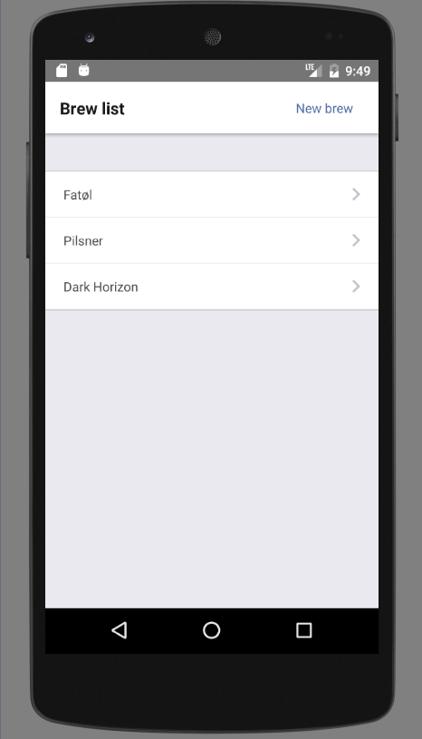

# Velkommen til jubileumskurs

Vi skal lage en applikasjonen som holder styr på enkeltinvidets ølsamling, ala [untapped](https://untappd.com/).
En bruker skal kunne se listen over øl, detaljer om en øl samt legge inn nye øl.

Oppgaven tar utgangspunkt i en kodebase vi har skrevet, og din jobb er å utvide denne.

##  Oppsett

- Følg oppskriften på https://facebook.github.io/react-native/docs/getting-started.html
- **For iOS på Mac:** Husk at du trenger Xcode. Det bør lastes ned på forhånd. Du finner det [her](https://itunes.apple.com/us/app/xcode/id497799835?mt=12).
- **For Android:** Sørg for at du har startet en emulator før du fortsetter.

Sett opp grunleggende avhengigheter:

- Start terminalen
- Naviger til prosjektmappen
- Installer Yarn (vi bruker det i stedet for npm) med kommandoen:  
  `npm install -g yarn` (bruk `sudo` hvis du får tilgangsfeil)
- Installer avhengigheter:  
  Kall `yarn` fra kommandolinjen i prosjektmappen

For å starte applikasjonen:

#### Mac
- Start app i emulator med kommandoen  
  `react-native run-ios`
- Hvis du får feilmelding, åpne meny i appen ved å trykke `Cmd+D` og trykk `Reload`.

#### Linux

- Start app i emulator: `react-native run-android`
- I noen tilfeller må man også kjøre `react-native start` som bygger JavaScript-applikasjonen
- Hvis du får feilmelding åpne meny i appen ved å trykke `Ctrl+M` (evt. dobbeltrykk `R`) og trykk `Reload`

#### Windows

- Start app i emulator: `react-native run-android` (android emulator må allerede være startet)
- I noen tilfeller må man også kjøre `react-native start` som bygger JavaScript-applikasjonen
- Hvis du får feilmelding åpne meny i appen ved å trykke `Ctrl+M` (evt. dobbeltrykk `R`) og trykk `Reload`

Nå kan du endre kode i `app`-mappen. Reload applikasjonen som nevnt over eller aktiver `Enable Hot Reloading`
i menyen for at dette skjer automatisk ved endringer.

## Synkronisering av data

For å gjøre det ekstra spennende har vi satt opp [Firebase](https://firebase.google.com/) som gjør at
din liste over øl vi være den samme som alle andre sin liste. Når du endrer din liste, endrer også de andre
sin liste seg.

Når du starter applikasjonen vil listen over øl bli synkronisert. Derfor er det ingen "initiell data"
i koden. Se gjerne på `brewPropType` i `Brew.js`-komponenten for hvordan en øl er representert. 

Data i applikasjonen organiseres ved hjelp av noe som heter [Redux](https://github.com/reactjs/redux).
Vi har forsøkt å skjerme deg fra å tenke så mye på dette, men vil anbefaler deg å sjekke ut Redux
i etterkant av kurset.

## Oversikt over oppgaver

Oppgavene er delt inn i egne steg nedenfor.

Hvis du står fast så har vi også laget et løsningsforslag for de ulike stegene, som er egne brancher i Git:

- [master](https://github.com/capraconsulting/abakus-jubileumskurs/tree/master)
  (denne tar dere utgangspunkt i)
- [steg-1](https://github.com/capraconsulting/abakus-jubileumskurs/tree/steg-1)
  (løsningsforslag steg 1)
- [steg-2](https://github.com/capraconsulting/abakus-jubileumskurs/tree/steg-2)
  (løsningsforslag steg 2)
- [steg-3](https://github.com/capraconsulting/abakus-jubileumskurs/tree/steg-3)
  (løsningsforslag steg 3)

(Det er også en branch [final](https://github.com/capraconsulting/abakus-jubileumskurs/tree/final) som brukes
internt for å lage workshoppen. Denne trenger dere ikke bry dere om.)

## Steg 1: Presentere liste over innlagte øl

Utvid filen `component/BrewList.js`. Her kan du benytte `elements/List`-komponenten som hjelper
deg med å presentere en ferdig liste hvis du sender inn korrekte props.

I `BrewList.js` så inneholder variabelen `brewList` en liste over alle brew som eksisterer. Når du
starter applikasjonen skal du ha en ferdig liste vi har lagt inn for deg. Se gjerne på
`brewPropType` i `Brew.js`-komponenten for hvordan en øl er representert, altså hvordan
innholdet elementene i `brewList` ser ut.

## Steg 2: Vise detaljer for en øl

For å kunne se mer detaljer om en øl ønsker vi å kunne gå inn på detaljvisning. Vi har laget
en egen komponent `Brew.js` som kan utvides til å vise detaljer om en øl.

For å navigere til denne komponenten har vi laget en hjelpemetode i `BrewList.js` som heter
`navigateToBrew`. Da blir man sendt til `Brew.js` med `brew` som prop. Se hint i `BrewList.js`
for hvordan du kan gå frem for å legge inn en slik lenke.

Når du navigerer til en øl vil det automatisk komme en tilbakeknapp øverst.

##  Steg 3: Legge inn en ny øl

### Lage lenke til "ny øl"

Fra listen som vises ønsker du å kunne navigere til "ny øl"-skjermen. Du må derfor legge inn en lenke
til dette. I `BrewListContainer.js` sin `navigationOptions`-objekt er det et element `right` i `header`
som rendrer teksten til høyre i headeren. Her kan du lage en knapp som fyrer av `navigate` med navn
på ruten vi skal gå til. Se filen `BrewListContainer.js` for nærmere hint.

I React og Redux-verden så er `BrewListContainer.js` en spesiell komponent som sørger for å binde data
i applikasjonen sammen. I denne workshoppen trenger du ikke tenke særlig stort på dette da vi for det
meste har tatt hånd om det for for deg.

For spesielt interesserte kan man gjerne lese nærmere på
[React Navigation](https://reactnavigation.org/) som vi bruker til navigasjon.

### Lage skjema for "ny øl"

Utvid filen `components/NewBrew.js`.
Her skal dere lage et view som lar brukeren legge inn øl med navn, produsent, prosent, type, og rating.
Dere kan benytte ferdige komponenter som ligger i `elements`-mappen. Legg spesielt merke til
`propTypes` i disse komponentene som er `isRequired`. Disse skal som minimum implementeres.

Når et felt endrer seg så skal man gi beskjed oppover i React om dette. Hver av feltene som støttes
har derfor en egen funksjon som f.eks. `onBrewNameChanged` som kan sendes til input-feltet.

For å opprette ølen må det legges inn en knapp som kaller på `onAddBrewClick` når den trykkes på.
Hvis alt er gjort riktig vil du nå se listen over øl med den nye du la inn.

## Steg 4: Fritt frem

Hvis du har kommet så langt som dette så står du fritt til å prøve og utforske mer i
React Native. Det vil sannsynligvis kreve forståelse av Redux som benyttes for å
lagre tilstand og koble applikasjonen sammen.

Ideer du kan prøve på:

- Redigere øl
- Slette øl
- Ta bilde av en øl og legge inn
