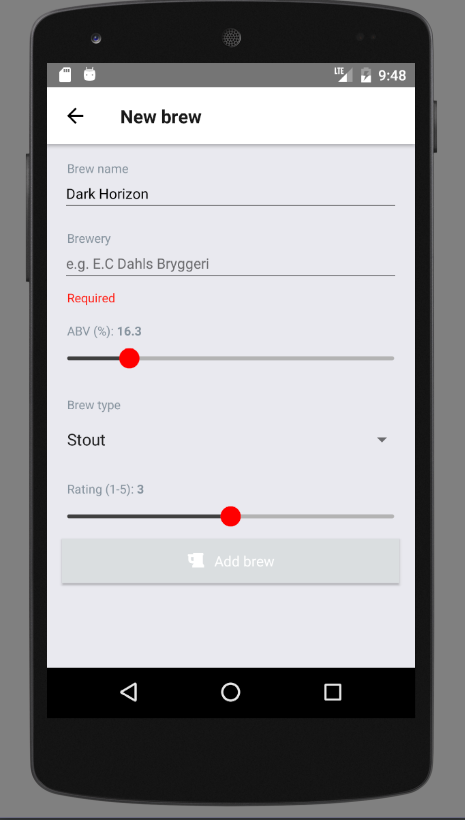
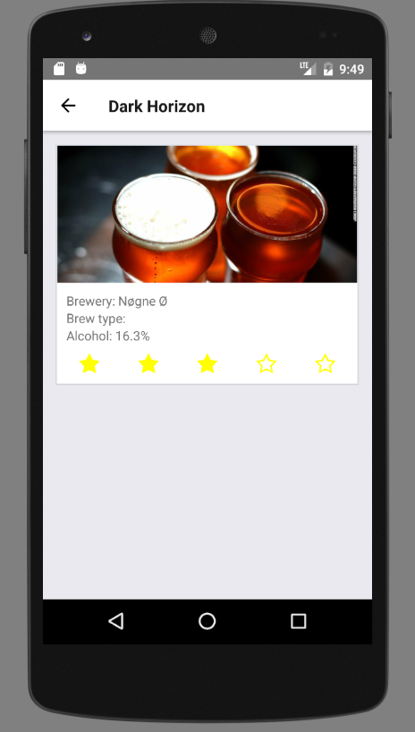

# Velkommen til jubileumskurs

Vi skal lage en applikasjonen som holder styr på enkeltinvidets ølsamling. (untapped (https://untappd.com/))
En bruker skal kunne legge inn nye øl, samt se en oversikt over øl som er lagt inn.

##  Setup

- Følg oppskriften på https://facebook.github.io/react-native/docs/getting-started.html
- **For iOS på Mac:** Husk at du trenger Xcode. Det bør lastes ned på forhånd. Du finner det [her](https://itunes.apple.com/us/app/xcode/id497799835?mt=12).
- **For Android:** Sørg for at du har startet en emulator før du fortsetter.

Sett opp grunleggende avhengigheter:
- Start terminalen
- Naviger til prosjektmappen
- Installer Yarn (vi bruker det i stedet for npm) med kommandoen:  
  `npm install -g yarn` (bruk `sudo` hvis du får tilgangsfeil)
- Installer avhengigheter:  
Kall `yarn` fra kommandolinjen i prosjektmappen

For å starte applikasjonen:

#### Mac
- Start app i emulator med kommandoen  
`react-native run-ios`
- Hvis du får feilmelding, åpne meny i appen ved å trykke `Cmd+D` og trykk `Reload`.

#### Linux

- Start app i emulator: `react-native run-android`
- I noen tilfeller må man også kjøre `react-native start` som bygger JavaScript-applikasjonen
- Hvis du får feilmelding åpne meny i appen ved å trykke `Ctrl+M` (evt. dobbeltrykk `R`) og trykk `Reload`

#### Windows

- Start app i emulator: `react-native run-android` (android emulator må allerede være startet)
- I noen tilfeller må man også kjøre `react-native start` som bygger JavaScript-applikasjonen
- Hvis du får feilmelding åpne meny i appen ved å trykke `Ctrl+M` (evt. dobbeltrykk `R`) og trykk `Reload`

Nå kan du endre kode i `app`-mappen. Reload applikasjonen som nevnt over eller aktiver `Enable Hot Reloading` i menyen for at dette skjer automatisk ved endringer.

Hvis du står fast og trenger hjelp, eller vil se hvordan vi har løst de forskjellige stegene, kan du titte i branchen med navn
[final](https://github.com/capraconsulting/abakus-jubileumskurs/tree/final).

##  Steg 1: Legge inn en ny øl

Utvid filen `components/NewBrew.js`.
Her skal dere lage et view som lar brukeren legge inn øl med navn, produsent, prosent, type, og rating.
Dere kan benytte ferdige komponenter som ligger i `elements`-mappen. Legg spesielt merke til
`propTypes` som har verdi `isRequired`. Disse skal som minimum implementeres.

Når et felt endrer seg så skal man gi beskjed oppover i React om dette. Hver av feltene som støttes
har derfor en egen funksjon som f.eks. `onBrewNameChanged` som kan sendes til input-feltet.

For å opprette ølen må det legges inn en knapp som kaller på `onAddBrewClick` når den trykkes på.
Hvis alt er gjort riktig vil du da få en melding om det som er registrert.

I neste steg utvider vi dette til at man får en liste over innlagte øl.

## Steg 2: Presentere liste over innlagte øl

Utvid filen `component/BrewList.js`. Her kan du benytte `elements/List`-komponenten som hjelper
deg med å presentere en ferdig liste hvis du sender inn korrekte props.

For å kunne få opp listen må vi endre hvilken komponent som viser seg når appen starter. Se
`app.js` for hint.

Når listen nå vises ønsker du å kunne navigere til ny øl skjermen. Du må da legge inn en lenke
til dette. Dette kan du f.eks. gjøre i header-elementet sin `right` metode. Dette ligger i
`BrewListContainer.js` som inneholder binding mellom komponenter og resten av applikasjonen.
For spesielt interesserte kan man gjerne lese nærmere på
[React Navigation](https://reactnavigation.org/) som vi bruker til navigasjon.

Det siste du må gjøre nå er å endre slik at når du lagrer en øl så blir den faktisk opprettet
i listen. Her må du endre funksjonen som kalles når man trykker lagrer øl. Vi har lagt inn
noen hint for å hjelpe deg.

## Steg 3: Vise detaljer for en øl

For å kunne se mer detaljer om en øl ønsker vi å kunne gå inn på detaljvisning. Vi har laget
en egen screen med komponenten `Brew.js` som kan utvides til å vise detaljer om en øl som
sendes inn som props.

For å navigere til denne komponenten har vi laget en hjelpemetode i `BrewList.js` som heter
`navigateToBrew(brewName, index)` som kan kalles. Da blir man sendt til `Brew.js` med
`brew` som prop.

Navigasjonskomponenten som følger med sørger for at du allerede har en tilbakeknapp.

## Steg 4: Fritt frem

Hvis du har kommet så langt som dette så står du fritt til å prøve og utforske mer i
React Native. Det vil sannsynligvis kreve forståelse av Redux som benyttes for å
lagre tilstand og koble applikasjonen sammen.

Ideer du kan prøve på:

- Redigere øl
- Slette øl
- Ta bilde av en øl og legge inn
